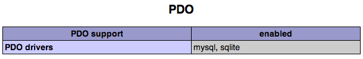
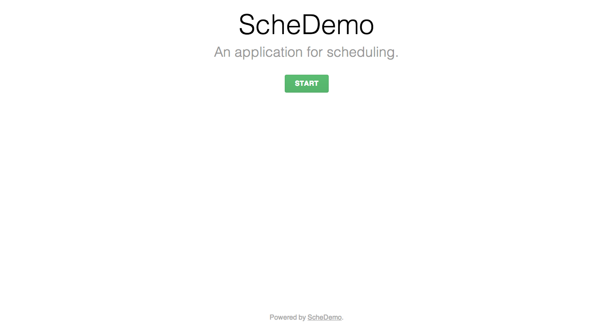
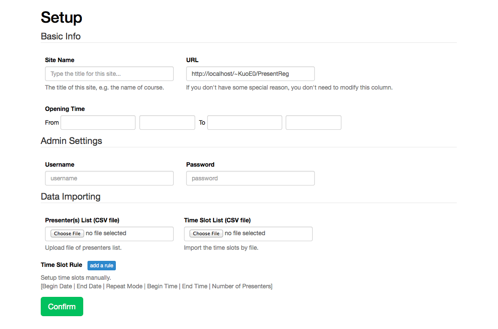

ScheDemo
==========

Version: v1.0.2

ScheDemo is a web-based application for scheduling.

Requirement
-----------

- Apache Web Server with Rewrite Module Enabled
- PHP5 with PDO-sqlite Driver
- [bower](http://bower.io/)

Web Server Settings
-------------------

**Ubuntu 13.04**

First, install apache web server.

	$ apt-get install apache

And then, enable the rewrite module.

	$ a2enmod rewrite

Finally, restart the Apache web service.

	$ service apache restart

**OS X 10.9**

Apache Web Server is built-in OS X. So, just type the command below to launch it.

	$ sudo apachectl start

And then, enable the rewrite module. Open the file `/etc/apache2/httpd.conf` and uncomment this line below.

	LoadModule rewrite_module libexec/apache2/mod_rewrite.so

Finally, restart the Apache web server.

	$ sudo apachectl restart

PHP Settings
------------

**Ubuntu 13.04**

	$ apt-get install php php5-sqlite

Finally, restart the Apache web service.

	$ service apache restart

Let's check the PHP configuration, add a file in DocumentRoot.

	$ echo '<?php phpinfo() ?>' > /var/www/info.php

Open browser and go to this site `localhost/info.php`. Find `PDO` string to check the sqlite support.

**OS X 10.9**

Enable PHP module for Apache. Open the file `/etc/apache2/httpd.conf` and uncomment this line below.

	LoadModule php5_module libexec/apache2/libphp5.so

And then, copy the default php settings file.

	$ cp /etc/php.ini.default /etc/php.ini
	
To prevent some warning, enable output_buffering in `php.ini`.

	output_buffering = On
	
Finally, restart the Apache web server.

	$ sudo apachectl restart

Let's check the PHP configuration, add a file in DocumentRoot.

	$ echo '<?php phpinfo() ?>' > /Library/WebServer/Documents/info.php

Open browser and go to this site `localhost/info.php`. Find `PDO` string to check the sqlite support.

Application Settings
--------------------

**Directory Permission**

First, download the source code.
	
	$ git clone http://github.com/KuoE0/ScheDemo

And then, set the group of this directory to `www-data` (`_www` in OS X) or the group of apache.
	
	$ chgrp www-data ScheDemo

Finally, add the writable permission to group.

	$ chmod g+w ScheDemo

**3-party Packages Installation**

First, go to the directory of the application.

	$ cd ScheDemo

And then, type the command below to install the 3-party packages.

	$ bower install

Screenshot
----------

To-do
-----

1. admin login function
2. ajax timetable update
3. ajax setup
4. form validation

